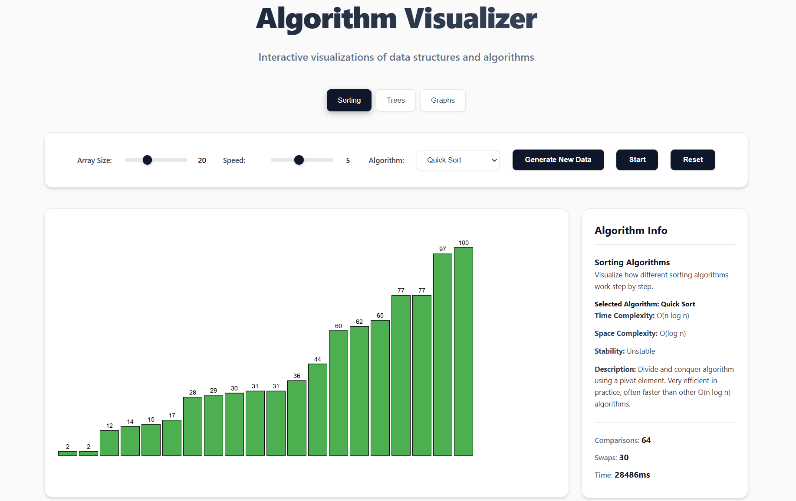

A web app to help visualize how different algorithms work. You get to actually see what's happening under the hood when you run sorting algorithms or traverse graphs.

## What it does

The app shows you step-by-step how algorithms work by animating the data structures. You can watch bubble sort swap elements, see how BFS explores a graph level by level, or follow tree traversals as they visit nodes.

## Features

- **Sorting algorithms**: Bubble, Selection, Insertion, Quick, and Merge sort
- **Tree traversals**: Inorder, Preorder, and Postorder
- **Graph algorithms**: BFS and DFS with customizable starting points
- **Interactive controls**: Adjust speed, array size, and algorithm selection
- **Real-time stats**: See comparisons, swaps, and execution time

Just open `index.html` in your browser. The app uses p5.js for the visualizations, so make sure you have an internet connection for the script to load.
